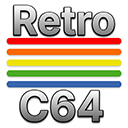

# RetroC64 VSCode Extension



This is the official Visual Studio Code extension for the RetroC64 debugger. The debugger is actually implemented entirely in the RetroC64 .NET runtime by using the Debug Adapter Protocol (DAP). This extension provides only the necessary VSCode integration to connect to the RetroC64 debugger easily from within VSCode.

## Features

- **Attach to debugger**: Connect to RetroC64 debugger running on port 6503 (default)
- **Register access**: Full read-write access to CPU registers, CPU flags, stack, and zero page addresses
- **Hardware registers**: Access to VIC and SID registers
- **Breakpoints**: Set code breakpoints and data breakpoints (watchpoints)
- **Execution control**: Step-in, step-over, step-out, pause, and continue
- **Memory inspection**: View RAM contents
- **Code analysis**: View disassembly

Check the [RetroC64](https://github.com/RetroC64/RetroC64) repository for more information about the RetroC64 debugger itself.


## Usage

Create the following `launch.json` file in your project and press F5 to start debugging:

```json
{
  "version": "0.2.0",
  "configurations": [
    {
      "name": "RetroC64 Attach",
      "type": "RetroC64",
      "request": "attach",
      "debugServer": 6503
    }
  ]
}
```

## 🪪 License

This software is released under the [BSD-2-Clause license](https://opensource.org/licenses/BSD-2-Clause). 

## 🤗 Author

Alexandre Mutel aka [xoofx](https://xoofx.github.io).
